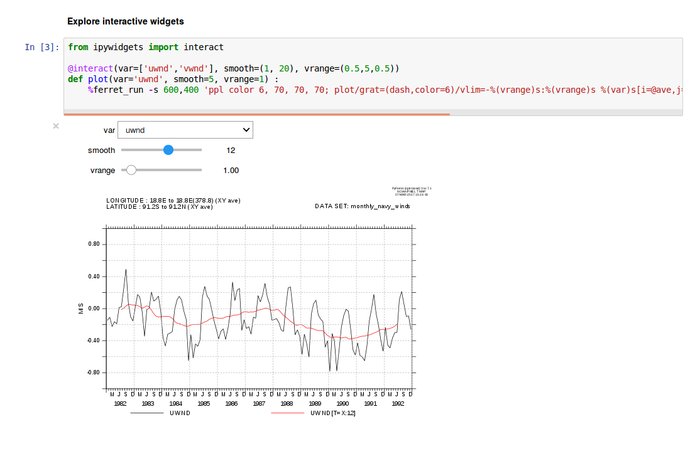

ipython_ferretmagic
===================

IPython notebook extension for ferret (a great software for Data Visualisation and Analysis from NOAA/PMEL).

Browse the demo notebooks from http://nbviewer.ipython.org/github/PBrockmann/ipython_ferretmagic/tree/master/notebooks

Combine ferret and ipython widgets and create interactive notebooks !

Test it with binder.
[](https://mybinder.org/v2/gh/PBrockmann/ipython_ferretmagic/master)

Browse a basic ferret tutorial using ferretmagic from: https://github.com/PBrockmann/C-CASCADES_notebooks/blob/master/ferretBasics.ipynb



## Latest news 

2018/01/18
 * a Docker image is available from https://hub.docker.com/r/pbrockmann/pyferret-7.3/
 * pyferret 7.3 and ferretmagic extension can now be fully tested from binder (http://mybinder.readthedocs.io/en/latest) !
 * Tested with pyferret==7.3, jupyter==4.4.0, ipython==5.5.0, ipywidgets==7.0.5

2017/03/17
 * Tested with pyferret==7.1, jupyter==4.2.0, ipywidgets==6.0.0

2016/10/28
 * Tested with pyferret==7.0, jupyter==4.2.0 and ipython==5.1.0
 * Installation from pip

## Installation

Install PyFerret following instructions from http://ferret.pmel.noaa.gov/Ferret/documentation/pyferret
It will set all directories needed to run pyferret (font, ppl, jnls, datasets, ...).

You can also install PyFerret as a conda package from https://anaconda.org/conda-forge/pyferret (no datasets distributed).

Then install the ferret magic extension (ferretmagic.py) by typing
```pip install ferretmagic```
    
## Usage

In a Jupyter notebook with kernel python (previously named ipython), load the magics:

    In [2]: %load_ext ferretmagic
   
### Line magics

The `%ferret_run` magic enables one-line execution of ferret command in the IPython interpreter or notebook:

```
    In [3]: for i in [100,500,1000]:
      ....: 	%ferret_run -s 400,400 'plot sin(i[i=1:%(i)s]*0.1)' % locals()
```

### Cell magics

Multi-line input can be entered with the `%%ferret` cell magic:

```
In [4]: %%ferret
  ....: use levitus_climatology
  ....: shade temp[k=1]			! comments
```

* Control size of plot with --size, -s option.
* Create a local pdf at the same time with --pdf, -p option.

```
In [5]: %%ferret -s 400,300 -pdf myfig.pdf
  ....: shade temp[k=1]			
```

### Passing variables between Python and ferret 

* Variables can be pushed from IPython into ferret with `%ferret_putdata`:

```
In [18]: %%ferret
   ....: use levitus_climatology
In [19]: %ferret_getdata tempdict = temp
   ....: Message: tempdict is now available in python as a dictionary containing the variable's metadata and data array.
In [20]: print tempdict.keys()
   ....: ['axis_coords', 'axis_types', 'data_unit', 'axis_units', 'title', 'axis_names', 'missing_value', 'data']
```

* Variables can be pulled from ferret into IPython with `%ferret_getdata`:

```
In [31]: import numpy as np
   ....: b = {}
   ....: b['name']='myvar'
   ....: b['name']='myvar'
   ....: x=np.linspace(-np.pi*4, np.pi*4, 500)
   ....: b['data']=np.sin(x)/x
   ....: b.keys()
Out[31]: ['data', 'name']
In [32]: %ferret_putdata --axis_pos (1,0,2,3,4,5) b
   ....: Message: b is now available in ferret as myvar
```

Explore notebook for examples.

## Known issues and limitations

* Note that the pdf file produced by -p,--pdf option is not embedded in the notebook
* Limitations are the ones exposed from pyferret, the qualifier /pattern is not usable for example. Read http://ferret.pmel.noaa.gov/Ferret/documentation/pyferret/known-issues

